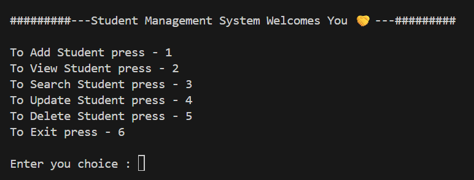
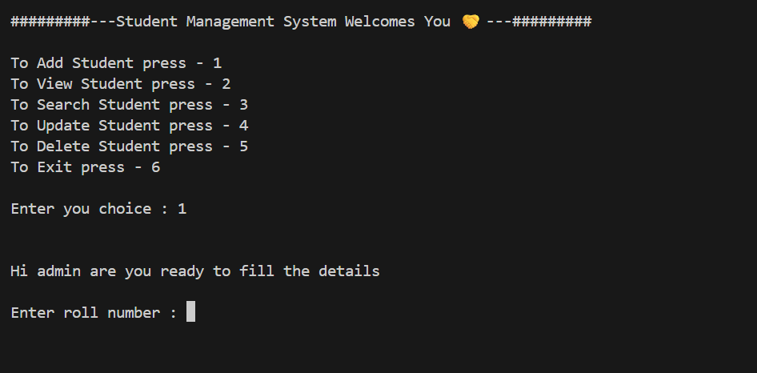
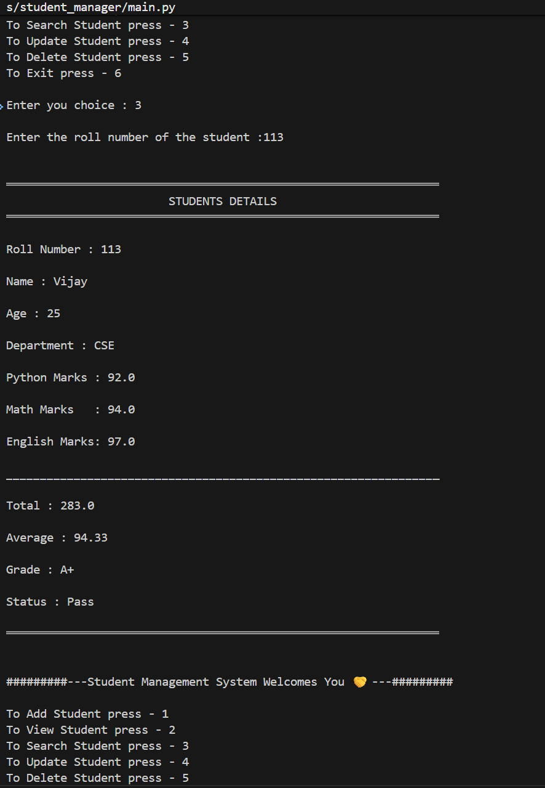
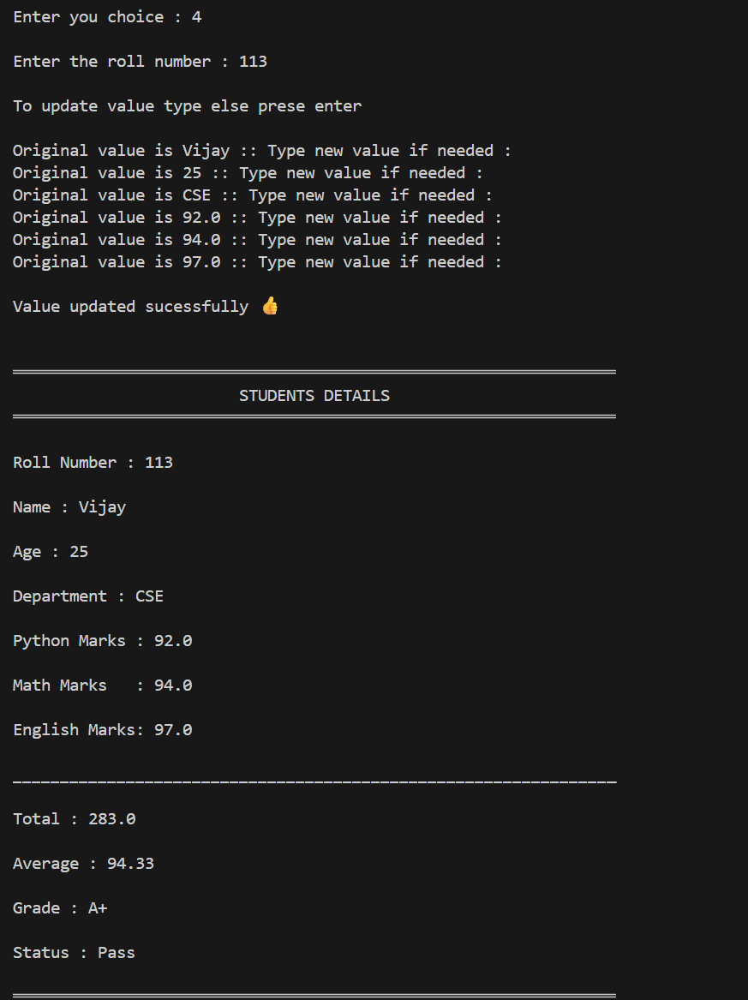
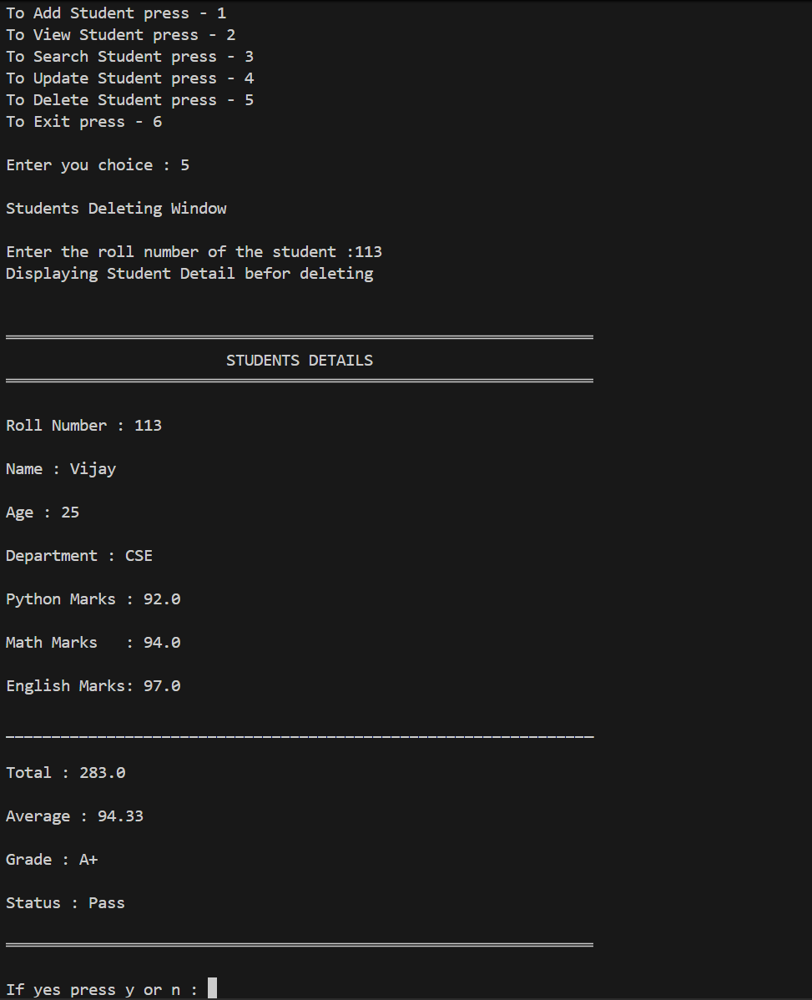

<div align="center">

# 🎓 Student Management System

### 🚀 A Professional Python-Based Student Management Application

<p align="center">


</p>

<p align="center">


</p>

</div>

---

# 📖 About The Project

Student Management System is a **feature-rich command-line application** developed in **Python** to demonstrate practical software engineering concepts.

Rather than focusing only on Python syntax, this project was built to simulate the development of a real software application using incremental feature development, Git version control, documentation, and clean coding practices.

The application supports complete **CRUD (Create, Read, Update, Delete)** operations while providing additional features such as analytics, backup & restore, and CSV export.

---

# ✨ Features

## 👨‍🎓 Student Management

- ➕ Add Student
- 📋 View Students
- 🔍 Search Student
- ✏️ Update Student
- ❌ Delete Student

---

## 📊 Statistics Dashboard

- Total Students
- Passed Students
- Failed Students
- Highest Average
- Lowest Average
- Class Average
- Pass Percentage
- Fail Percentage
- Topper Information

---

## 💾 Backup System

- Automatic Backup Creation
- Timestamp Based Backup
- Backup Validation

---

## ♻ Restore System

- Restore Previous Backups
- Backup Selection
- Restore Confirmation
- Safe Database Recovery

---

## 📄 CSV Export

- Export Student Records
- Microsoft Excel Compatible
- Google Sheets Compatible
- LibreOffice Compatible

---

## 🛡 Validation

- Duplicate Roll Number Detection
- Numeric Input Validation
- Empty Database Validation
- File Existence Checking
- Safe Restore Validation

---

# 🛠 Tech Stack

| Technology | Purpose |
|------------|---------|
| Python 3 | Programming Language |
| File Handling | Data Storage |
| CSV Module | CSV Export |
| datetime | Timestamp Generation |
| shutil | Backup & Restore |
| os | File Management |
| Git | Version Control |
| GitHub | Repository Hosting |

---

# 🎯 Learning Objectives

This project was developed to strengthen practical knowledge in:

- Python Programming
- Functions
- Modular Programming
- File Handling
- Exception Handling
- Software Engineering
- Git & GitHub
- Software Documentation

---

# 📸 Application Preview

## 🏠 Main Menu



---

## ➕ Add Student



---

## 🔍 Search Student



---

## ✏️ Update Student



---

## ❌ Delete Student



---

# ⭐ Highlights

✔ Feature-by-feature development

✔ Professional Git history

✔ Stable Release (v1.0)

✔ MIT License

✔ Complete Documentation

✔ Portfolio Project

✔ Beginner-Friendly

✔ Open Source

---

> ⭐ If you like this project, consider giving it a **Star** on GitHub.

---
---

# 📂 Project Structure

```text
student-management-system-python/
│
├── 📁 Backup/
│   ├── backup_2026-07-15_184512.txt
│   ├── backup_2026-07-16_091245.txt
│   └── backup_2026-07-17_205311.txt
│
├── 📁 screenshots/
│   ├── menu.png
│   ├── add_student.png
│   ├── search_student.png
│   ├── update_student.png
│   └── delete_student.png
│
├── 📄 CHANGELOG.md
├── 📄 LICENSE
├── 📄 README.md
├── 📄 requirements.txt
├── 🐍 imports_lib.py
├── 🐍 main.py
├── 📄 student.txt
├── 📄 student.csv
└── 📄 .gitignore
```

---

# ⚙️ Installation

## 1️⃣ Clone the Repository

```bash
git clone https://github.com/soumith-64/student-management-system-python.git
```

---

## 2️⃣ Navigate into the Project

```bash
cd student-management-system-python
```

---

## 3️⃣ Run the Application

```bash
python main.py
```

---

# 📋 Requirements

- Python 3.10 or higher
- Windows / Linux / macOS
- Git (Optional)

---

# 🚀 Application Workflow

```text
Start Program
      │
      ▼
Display Main Menu
      │
      ▼
User Selects Feature
      │
      ▼
Input Validation
      │
      ▼
Execute Operation
      │
      ▼
Save Changes
      │
      ▼
Return to Main Menu
```

---

# 🏗️ Software Architecture

```text
                    Student Management System

                               │

     ┌─────────────────────────┼─────────────────────────┐

     ▼                         ▼                         ▼

 CRUD Operations         Dashboard Module          Backup Module

     │                         │                         │

     ▼                         ▼                         ▼

Student Records         Statistics Engine        Backup Manager

     │                         │                         │

     └─────────────────────────┼─────────────────────────┘

                               ▼

                         student.txt

                               │

               ┌───────────────┴───────────────┐

               ▼                               ▼

        Restore Module                  CSV Export
```

---

# 🔄 Feature Flow

## ➕ Add Student

```text
User Input

↓

Validate Input

↓

Calculate Total

↓

Calculate Average

↓

Calculate Grade

↓

Calculate Status

↓

Save Student

↓

Success
```

---

## 🔍 Search Student

```text
Enter Roll Number

↓

Read Database

↓

Compare Roll Number

↓

Student Found?

↓

YES → Display Student

NO  → Student Not Found
```

---

## ✏️ Update Student

```text
Search Student

↓

Student Found

↓

Enter New Details

↓

Recalculate Marks

↓

Rewrite Database

↓

Success
```

---

## ❌ Delete Student

```text
Search Student

↓

Student Found

↓

Confirmation

↓

Delete Record

↓

Save File

↓

Success
```

---

## 📊 Statistics Dashboard

```text
Read Database

↓

Count Students

↓

Calculate Pass / Fail

↓

Highest Average

↓

Lowest Average

↓

Class Average

↓

Display Dashboard
```

---

## 💾 Backup System

```text
Check Database

↓

Generate Timestamp

↓

Create Backup Folder

↓

Copy Database

↓

Backup Complete
```

---

## ♻️ Restore System

```text
List Backups

↓

Select Backup

↓

Confirmation

↓

Restore Database

↓

Completed
```

---

## 📄 CSV Export

```text
Read student.txt

↓

Split Records

↓

Create Header

↓

Generate CSV

↓

student.csv Created
```

---

# 📝 Student Record Format

Every student record is stored in the following format:

```text
Roll Number

↓

Name

↓

Age

↓

Department

↓

Python Marks

↓

Math Marks

↓

English Marks

↓

Total

↓

Average

↓

Grade

↓

Status
```

Example:

```text
101|Soumith|18|CSE|95|91|89|275|91.67|A+|Pass
```

---

# 🔒 Data Validation

The application safely validates:

- ✅ Duplicate Roll Numbers
- ✅ Invalid Menu Choices
- ✅ Invalid Numeric Inputs
- ✅ Empty Database Files
- ✅ Missing Backup Folder
- ✅ Invalid Restore Selection
- ✅ Missing Database
- ✅ CSV Export Validation

---

# 📊 Software Metrics

| Metric | Value |
|---------|------:|
| Programming Language | Python |
| Release Version | v1.0.0 |
| Total Features | 9 |
| Git Commits | 17+ |
| Documentation | Complete |
| License | MIT |

---

# 💡 Design Philosophy

This project follows a simple philosophy:

> **Build software one feature at a time.**

Instead of creating everything at once, every feature was planned, implemented, tested, committed, and documented separately.

This approach simulates how real software projects evolve over time.

---
---

# 🛣 Development Roadmap

This project was intentionally developed in multiple phases to simulate a real-world software development lifecycle.

| Phase | Feature | Status |
|:------:|---------|:------:|
| 1 | Student Registration | ✅ |
| 2 | View Students | ✅ |
| 3 | Search Student | ✅ |
| 4 | Update Student | ✅ |
| 5 | Delete Student | ✅ |
| 6 | Statistics Dashboard | ✅ |
| 7 | Backup Database | ✅ |
| 8 | Restore Database | ✅ |
| 9 | CSV Export | ✅ |
| 🚀 | Stable Release v1.0 | ✅ |

---

# 📅 Version History

## 🚀 Version 1.0.0

Current Stable Release

### Included Features

- Complete CRUD System
- Dashboard Analytics
- Backup Database
- Restore Database
- CSV Export
- Professional Documentation
- GitHub Release
- MIT License

---

## 🔮 Upcoming Version 2.0

The next major release will migrate the application from **text-file storage** to a **SQLite database**.

### Planned Features

- SQLite Database
- SQL Queries
- Faster Searching
- Better Performance
- Cleaner Project Structure

---

## 🖥 Planned Version 3.0

- Tkinter Desktop GUI
- Better User Experience
- Interactive Forms
- Enhanced Interface

---

## 🌐 Planned Version 4.0

- Flask Web Application
- Authentication System
- User Roles
- REST API
- Browser Access

---

# 🏆 Achievements

This repository demonstrates practical experience with:

- ✅ Python Programming
- ✅ Modular Functions
- ✅ File Handling
- ✅ CRUD Operations
- ✅ Statistics & Analytics
- ✅ CSV Processing
- ✅ Backup & Restore
- ✅ Defensive Programming
- ✅ Git Version Control
- ✅ GitHub Workflow
- ✅ Software Documentation

---

# 📚 Learning Outcomes

Building this project helped me improve my understanding of:

- Software Development Workflow
- Writing Maintainable Code
- Input Validation
- Project Documentation
- Version Control
- Incremental Feature Development
- Debugging
- Problem Solving

---

# 📊 Development Process

```text
Idea

↓

Planning

↓

Design

↓

Implementation

↓

Testing

↓

Documentation

↓

Version Control

↓

Release

↓

Continuous Improvement
```

---

# 💼 Portfolio Value

This project demonstrates knowledge of:

| Skill | Demonstrated |
|--------|:------------:|
| Python Programming | ✅ |
| Software Design | ✅ |
| File Handling | ✅ |
| Git & GitHub | ✅ |
| Documentation | ✅ |
| Debugging | ✅ |
| Problem Solving | ✅ |

---

# 📈 GitHub Statistics

> Automatically updated by GitHub.

<p align="center">


</p>

---

# 🔥 GitHub Contribution Streak

<p align="center">


</p>

---

# 🏅 GitHub Trophy Showcase

<p align="center">


</p>

---

# 👀 Repository Visitors

<p align="center">


</p>

---

# 🚀 Future Improvements

The project will continue evolving with the following planned features.

## Version 2

- SQLite Database
- Database Normalization
- Improved Search Performance

---

## Version 3

- Object-Oriented Programming
- Better Code Organization
- Tkinter GUI

---

## Version 4

- Flask
- Login Authentication
- Multi-user Support
- REST API

---

## Version 5

- Docker
- Cloud Deployment
- Unit Testing
- CI/CD Pipeline

---

# ⭐ Why This Project?

This repository represents my learning journey while studying Python and software engineering.

Instead of building isolated examples, I focused on developing one complete application feature by feature, following proper version control and documentation practices.

My goal was to create a project that reflects not only programming ability but also project organization and continuous improvement.

---
---

# 👨‍💻 About the Developer

<div align="center">

## Soumith J.V.

### Python Developer | Software Engineering Student | Open Source Learner

Passionate about building practical software projects while continuously learning modern software engineering practices.

Currently focused on Python, databases, backend development, and open-source technologies.

</div>

---

# 🎯 Current Learning

I enjoy learning by **building complete software projects** instead of solving isolated coding problems.

Currently learning:

- Python
- Object-Oriented Programming
- SQLite
- Git & GitHub
- Software Engineering
- Flask
- REST APIs
- Data Structures & Algorithms

---

# 💻 Technical Skills

## Languages

- Python

---

## Core Concepts

- Functions
- File Handling
- Exception Handling
- CRUD Operations
- Modular Programming
- Input Validation
- CSV Processing
- Backup & Restore

---

## Development Tools

- Visual Studio Code
- Git
- GitHub
- Windows Terminal

---

# 🤝 Contributing

Contributions are welcome.

If you would like to improve this project:

1. Fork the repository

2. Create a feature branch

```bash
git checkout -b feature/new-feature
```

3. Commit your changes

```bash
git commit -m "feat: add amazing feature"
```

4. Push your branch

```bash
git push origin feature/new-feature
```

5. Open a Pull Request

---

# 🐞 Reporting Issues

Found a bug?

Please open an Issue with:

- Bug Description
- Steps to Reproduce
- Expected Behaviour
- Screenshots (if applicable)

Every suggestion helps improve the project.

---

# ⭐ Support

If you found this project useful,

please consider:

⭐ Starring the repository

🍴 Forking the project

📢 Sharing it with others

Your support motivates me to continue building high-quality open-source projects.

---

# 📬 Connect With Me

<div align="center">

<a href="https://github.com/soumith-64">

</a>

<a href="https://www.linkedin.com/in/soumith-j-v-56042b407/">

</a>

</div>

---

# 📜 License

This project is licensed under the **MIT License**.

See the [LICENSE](LICENSE) file for more information.

---

# 🙏 Acknowledgements

This project was made possible thanks to:

- Python Community
- GitHub
- Open Source Contributors
- Everyone who shares programming knowledge

---

# 📌 Repository Status

| Category | Status |
|----------|:------:|
| Version | ✅ v1.0.0 |
| Documentation | ✅ Complete |
| Stable Release | ✅ |
| Open Source | ✅ |
| License | ✅ MIT |

---

# 🚀 Next Version

## Student Management System v2.0

The next release will include:

- 🗄 SQLite Database
- 🏗 Better Project Structure
- ⚡ Faster CRUD Operations
- 🧩 Object-Oriented Programming
- 📊 Better Reports
- 🖥 Tkinter GUI

---

<div align="center">

# 🌟 Thank You for Visiting!

If you enjoyed exploring this project,

please consider giving it a ⭐ on GitHub.

---

## Built with ❤️ using Python

### Developed by

# Soumith J.V.

### Python Developer • Software Engineering Student • Open Source Learner

---

*"Every expert was once a beginner who kept building."*

---

**Student Management System**

**Version 1.0.0**

© 2026 Soumith J.V.

</div>
