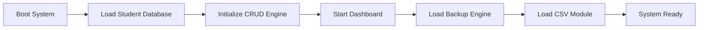
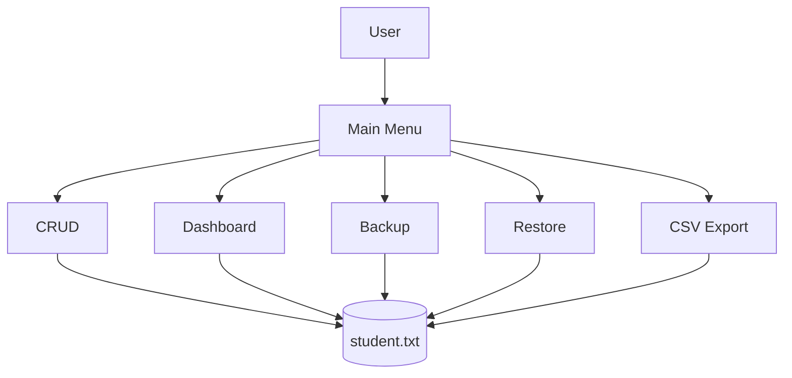
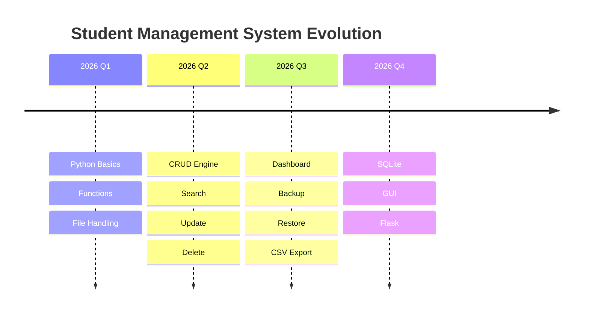
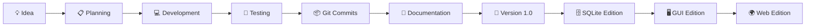
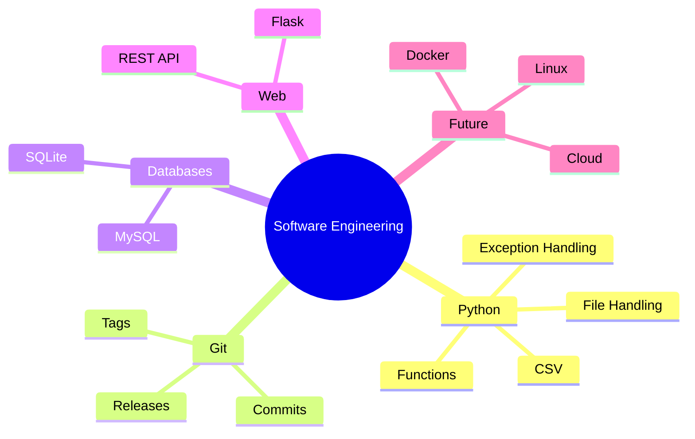
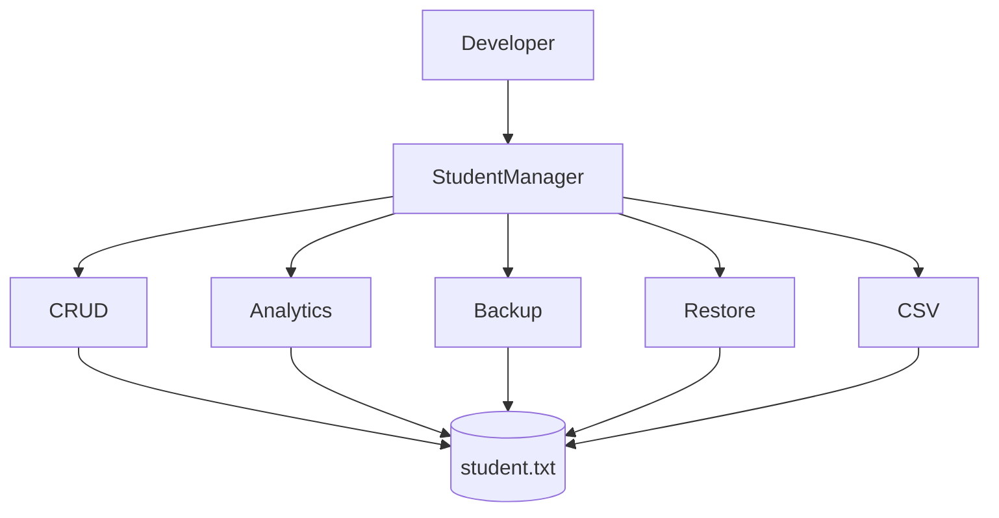
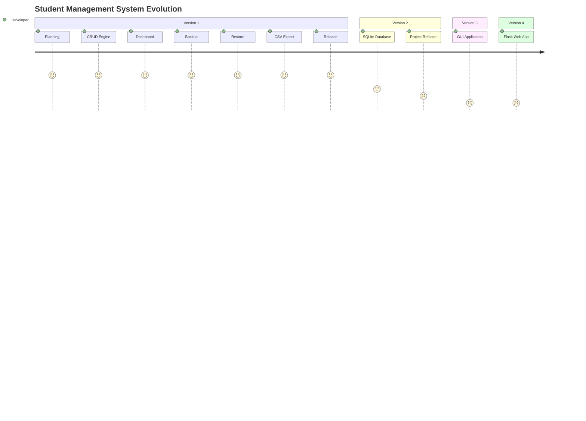

<!-- ========================================= -->
<!--          CYBERPUNK README PART 1          -->
<!-- ========================================= -->

<div align="center">


</div>

---

<div align="center">


</div>

---

<div align="center">


</div>

---

<div align="center">


</div>

---

# ⚡ PROJECT OVERVIEW

<table>

<tr>

<td width="55%">

## 🌌 Student Management System

A futuristic command-line application developed in **Python** demonstrating complete software engineering workflow.

### Core Features

- ⚡ CRUD Operations
- 📊 Analytics Dashboard
- 💾 Backup Engine
- ♻ Restore Engine
- 📄 CSV Export
- 🔐 Data Validation
- 🚀 Git Version Control

---

### Mission

Build professional software while learning Python through real-world projects.

</td>

<td width="45%">

## 🛰 SYSTEM STATUS

| MODULE | STATUS |
|---------|:------:|
| CRUD Engine | 🟢 |
| Analytics | 🟢 |
| Backup | 🟢 |
| Restore | 🟢 |
| CSV Export | 🟢 |
| Validation | 🟢 |

---

## 🔥 BUILD

| PROPERTY | VALUE |
|----------|-------|
| Version | v1.0 |
| Kernel | Python 3 |
| Status | Stable |
| License | MIT |

</td>

</tr>

</table>

---

<div align="center">


</div>

# 🚀 LIVE PROJECT DASHBOARD

<p align="center">


</p>

---

<p align="center">


</p>

---

<div align="center">

### 🌐 SYSTEM ACCESS

<a href="https://github.com/soumith-64">


</a>

<a href="https://www.linkedin.com/in/soumith-j-v-56042b407/">


</a>

</div>

---

# 🧠 BOOT LOG

```text
[00.001] Quantum Kernel Initializing...

[00.024] Authenticating User...

[00.036] Loading Student Database...

[00.052] CRUD Engine Loaded.

[00.067] Analytics Module Loaded.

[00.081] Backup Module Loaded.

[00.093] Restore Module Loaded.

[00.108] CSV Export Module Loaded.

[00.120] Security Check Passed.

[00.132] SYSTEM READY.

```

<div align="center">


</div>

<div align="center">


</div>

---

# 🛰️ CORE MODULES

<div align="center">

| ⚡ ENGINE | 🟢 STATUS | 📈 HEALTH |
|:---------|:---------:|:---------:|
| 👨‍🎓 Student Manager | ONLINE | ██████████ 100% |
| 🔍 Search Engine | ONLINE | ██████████ 100% |
| ✏️ Update Engine | ONLINE | ██████████ 100% |
| ❌ Delete Engine | ONLINE | ██████████ 100% |
| 📊 Analytics AI | ONLINE | ██████████ 100% |
| 💾 Backup Core | ONLINE | ██████████ 100% |
| ♻ Restore Core | ONLINE | ██████████ 100% |
| 📄 CSV Exporter | ONLINE | ██████████ 100% |

</div>

---

<div align="center">

# ⚡ FEATURE MATRIX

</div>

<table>

<tr>

<td align="center" width="33%">


### Student Engine

✔ Add

✔ Search

✔ Update

✔ Delete

✔ View

</td>

<td align="center" width="33%">


### Analytics

✔ Reports

✔ Dashboard

✔ Grades

✔ Statistics

✔ Topper

</td>

<td align="center" width="33%">


### Recovery

✔ Backup

✔ Restore

✔ Validation

✔ Timestamp

✔ Safe Recovery

</td>

</tr>

</table>

---

# 🌌 VISUAL INTERFACE

<div align="center">

### 🏠 Main Dashboard


</div>

---

<table>

<tr>

<td>

### ➕

Add Student


</td>

<td>

### 🔍

Search Student


</td>

</tr>

<tr>

<td>

### ✏️

Update Student


</td>

<td>

### ❌

Delete Student


</td>

</tr>

</table>

---

<div align="center">


</div>

# 🧬 SYSTEM CAPABILITIES

| Module | Completion |
|---------|------------|
| CRUD Engine | ████████████████████ 100% |
| Dashboard | ████████████████████ 100% |
| Backup | ████████████████████ 100% |
| Restore | ████████████████████ 100% |
| CSV Export | ████████████████████ 100% |
| Documentation | ████████████████████ 100% |

---

# ⚙️ SYSTEM EXECUTION



---

# 🛰️ SOFTWARE ARCHITECTURE



---

<div align="center">

## 🌌 QUANTUM STATUS

| COMPONENT | STATUS |
|:----------|:------:|
| 🔵 Kernel | ONLINE |
| 🟣 Memory | STABLE |
| 🟢 Database | CONNECTED |
| 🟡 Analytics | ACTIVE |
| 🔴 Security | ENABLED |

</div>

---

<div align="center">


</div>

<div align="center">


</div>

---

# 🌐 LIVE TELEMETRY

<div align="center">


</div>

---

<div align="center">


</div>

---

# 🐍 CONTRIBUTION NETWORK

<div align="center">


</div>

---

# 🛰️ DEVELOPMENT TIMELINE



---

# 🧠 PROJECT EVOLUTION



---

# ⚡ DEVELOPMENT PROGRESS

<div align="center">

| Mission | Status |
|:---------|:------:|
| 🚀 Python Fundamentals | 🟢 Completed |
| ⚡ CRUD System | 🟢 Completed |
| 📊 Dashboard | 🟢 Completed |
| 💾 Backup Engine | 🟢 Completed |
| ♻ Restore Engine | 🟢 Completed |
| 📄 CSV Export | 🟢 Completed |
| 📦 Version 1.0 | 🟢 Released |
| 🗄 SQLite Edition | 🟡 In Progress |
| 🖥 Tkinter GUI | 🔵 Planned |
| 🌍 Flask Web App | 🟣 Planned |

</div>

---

# 🎯 TECH STACK

<div align="center">


</div>

---

# 🧬 LEARNING PATH



---

# 🌍 SYSTEM MAP



---

<div align="center">

## 🌌 MISSION STATUS

| Module | Status |
|---------|:------:|
| 🟢 Core Engine | ONLINE |
| 🟢 Analytics | ONLINE |
| 🟢 Documentation | ONLINE |
| 🟢 GitHub | ONLINE |
| 🟢 Release | ONLINE |

</div>

---

<div align="center">


</div>
<!-- ========================================= -->
<!--         CYBERPUNK README PART 4           -->
<!-- ========================================= -->

<div align="center">


</div>

---

# 🚀 DEPLOYMENT PROTOCOL

```bash
# Clone Repository
git clone https://github.com/soumith-64/student-management-system-python.git

# Enter Project
cd student-management-system-python

# Launch System
python main.py
```

---

# 📂 FILE SYSTEM

```text
📦 student-management-system-python

 ├── 📂 Backup/
 ├── 📂 screenshots/
 ├── 📄 README.md
 ├── 📄 LICENSE
 ├── 📄 CHANGELOG.md
 ├── 📄 requirements.txt
 ├── 🐍 main.py
 ├── 🐍 imports_lib.py
 ├── 📄 student.txt
 └── 📄 student.csv
```

---

# 🌍 DEVELOPMENT ROADMAP



---

# 🧬 DEVELOPMENT MATRIX

| Technology | Current | Next Target |
|------------|:------:|:----------:|
| Python | ✅ | Advanced |
| Git | ✅ | GitHub Actions |
| SQLite | 🟡 | In Progress |
| OOP | 🟡 | Next |
| Flask | 🔵 | Planned |
| Docker | ⚪ | Future |
| Cloud | ⚪ | Future |

---

# 📡 LIVE REPOSITORY

<div align="center">


</div>

---

# 🎯 PROJECT OBJECTIVES

- ✅ Learn Python by building real software
- ✅ Practice Git & GitHub workflow
- ✅ Understand CRUD architecture
- ✅ Implement file handling
- ✅ Build a professional portfolio
- ✅ Prepare for database-driven applications

---

# 🤝 CONTRIBUTING

Contributions are welcome.

```bash
Fork Repository

↓

Create Branch

↓

Commit Changes

↓

Push

↓

Open Pull Request
```

---

# 📜 LICENSE

This project is licensed under the **MIT License**.

See the **LICENSE** file for complete details.

---

# 👨‍💻 DEVELOPER

<div align="center">

## Soumith J. V.

### Python Developer • Software Engineering Student • Open Source Learner

<a href="https://github.com/soumith-64">


</a>

<a href="https://www.linkedin.com/in/soumith-j-v-56042b407/">


</a>

</div>

---

<div align="center">

# ⭐ PROJECT STATUS


</div>

---

<div align="center">

## 🌌 FINAL TRANSMISSION


</div>

---

<div align="center">


</div>

<div align="center">

### ⭐ Built with Python

### 🚀 Developed by Soumith J. V.

### 💙 "Learn • Build • Improve • Repeat"

</div>
